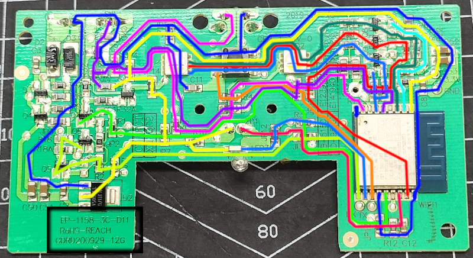

# esphome-xiaomi-smart-pet-fountain

ESPHome component for Xiaomi's Smart Pet Fountain (ESP8266 / ESP-WROOM-02D)


[Official Xiaomi Product Page](https://www.mi.com/global/product/xiaomi-smart-pet-fountain)

## Warning

**This repository is an ***in progress toy project***.**

## Motivation

I've bough this water fountain 3 years ago (as well as the [Xiaomi Smart Pet Food Feeder](https://www.mi.com/global/product/xiaomi-smart-pet-food-feeder/)) and I love them. 

The only two issues are the lack of integration with some kind of open ecosystem (like Home-Assistant or MQTT) and most importantly the fact that the `Mi Home` app randomly stop to send me notification (!!!).

It didn't stop me from buying a second one when the pump of the first one got issue.

I now have a spare one to tinker with and it's based on ESP that I'm now quite familiar with (wether with ESPHome, ESP-IDF or Arduino).

## Hardare

The hardware revision of the motherboard I have (and opened) is based around the the `ESP-WROOM-02D` that appears to be an `ESP8266` with one or two MB of Flash memory.

### Visual Inspection

Here's what I was able to follow using a multimeter and some patience.



Some quick informations:
- The `RESET` button located under the fountain is also used to put the ESP in `DOWNLOAD MODE`: unplug the fountain, press the button and *keep it pressed* and plug back the power.
- The pads `RX`/`TX`/`GND`/`3.3V` are where you need to solder your UART wires.
- The pump is powered with 5V but is controlled using 3.3V.

**NOTE:** _You can find the exact pins used by each led, button, etc. by reading the `yaml` configuration file for ESPHome_.

## ESPHome Firmware

### Features

This replacement firmware based on ESPHome tries to copy as many of the features of the original firmware.
  - Pump turn on on boot
    - If `Smart Mode` is `ON`, pump will run for 30s, wait 30, start again for 30s, etc.
    - Else, it will run all the time.
  - Front button switch between `Normal` and `Smart` pump mode.
    - Left LED: `Normal` mode.
    - Right LED: `Smart` mode.
  - Double click on front button can reset any active `Filter Change` or `Cleaning Required` alerts.
  - Front LEDs Colors:
    - Red: Attention Required (Eg: Cleaning or Filter Change required).
    - Blue: Pump is running.
    - White: Pump is idle (Eg: in `Smart` mode).
  - Water Level is monitored (**THIS IS A WORK IN PROGRESS**)
    - Alert is raised and red LED is turned on if water is too low.

Something missing ? I've been trying HARD to find something else I missed so if you are aware of something please notify me by creating an issue ! :)

### Installation

Here's a configuration example, ready to use. You can copy/paste it in your ESPHome configuration file.
You can then change the `substitutions` to match your needs.

NOTE: *You might need to define the secrets like `ota_password` or `ap_password` in your `secrets.yaml` file.*

```yaml
packages:
  esphome_xiaomi_smart_pet_fountain:
    url: https://github.com/Rohja/esphome-xiaomi-smart-pet-fountain
    ref: 0.0.1 # optional, but it's recommended to use a specific release
    files: [esphome/EP-1158-3C-D11.yaml]
    refresh: 1d # optional

substitutions:
  name: "your-water-fountain-name-here"
  friendly_name: "You Water Fountain Friendly Name Here"
  log_level: "INFO"

# Enable Home Assistant API
api:
  encryption:
    key: "!secret api_encryption_key"

ota:
  - platform: esphome
    password: !secret ota_password

wifi:
  ssid: !secret wifi_ssid
  password: !secret wifi_password

  # Optional, you can use DHCP too by commenting the lines bellow.
  # But you need to set DNS if using static IPs (for SNTP)
  manual_ip:
    static_ip: 192.168.0.X
    gateway: 192.168.0.1
    subnet: 255.255.255.0
    dns1: 8.8.8.8
    dns2: 1.1.1.1

  # Enable fallback hotspot (captive portal) in case wifi connection fails
  ap:
    ssid: ${name}
    password: !secret ap_password

captive_portal:

# Optional
web_server:
  port: 80
```

### How to get new version notifications

You can follow [this official Github guide](https://docs.github.com/en/account-and-profile/managing-subscriptions-and-notifications-on-github/managing-subscriptions-for-activity-on-github/viewing-your-subscriptions) to recieve notification on new releases.

### Troubleshooting

Nothing here, yet. Once some recurring issues are discovered this part will be updated.

## Home-Assistant Integration

For now, there's no specific card for this component but I plan to develop on in the style of [Mushroom cards](https://github.com/piitaya/lovelace-mushroom) and/or [Bubble cards](https://github.com/Clooos/Bubble-Card).

## LICENSE

This project is licensed under the MIT License - see the [LICENSE](LICENSE) file for details.